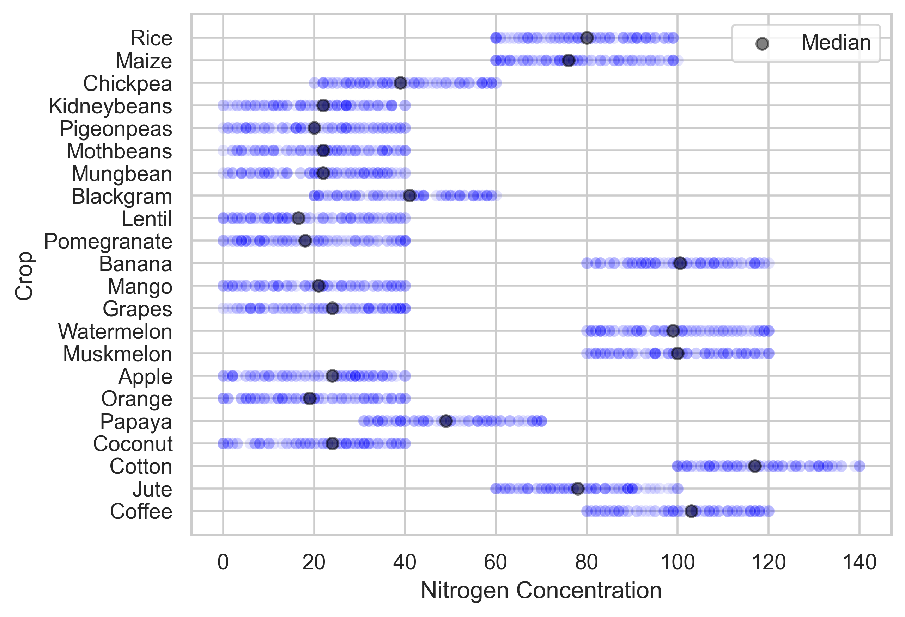
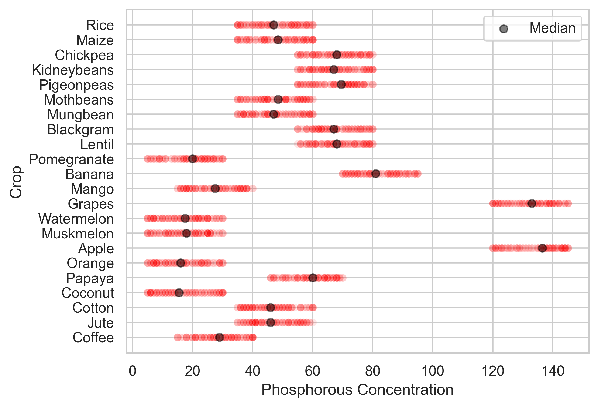
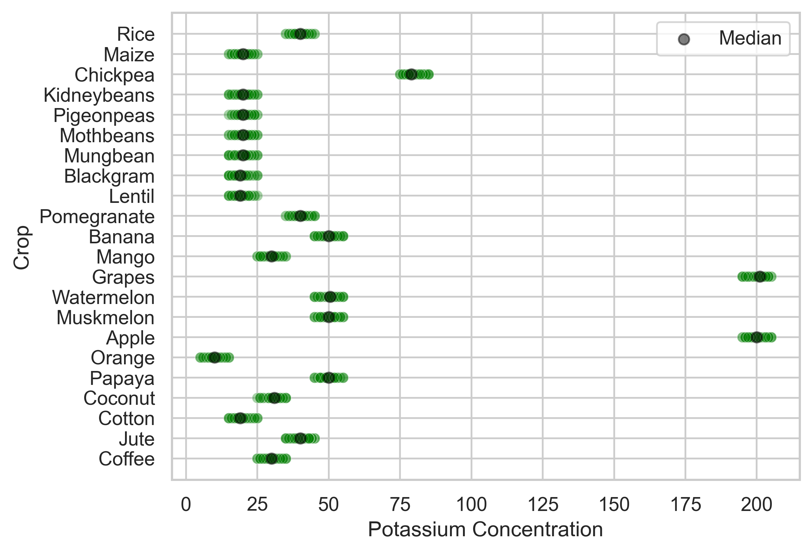
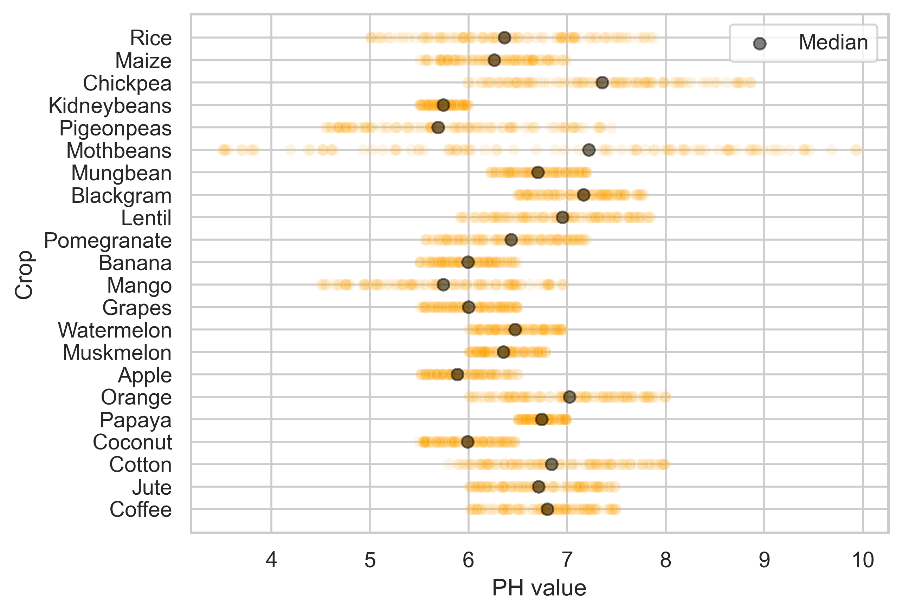

# Project: Predictive Modelling for Agriculture

## Objective
- Maximize the yield of different crops depending on the soil characteristics
- Find the feature that predicts the crop the best

## Strategy
- Multi-class classification to group crops given the conditions under which they thrive

## Describing the data

    
    

    
    

### Correlations

<iframe src="output/concentrations_correlations.html" width="100%" height="400" style="border:none;"></iframe>

## Key findings